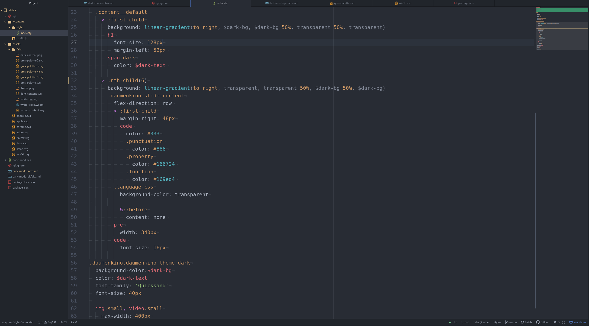
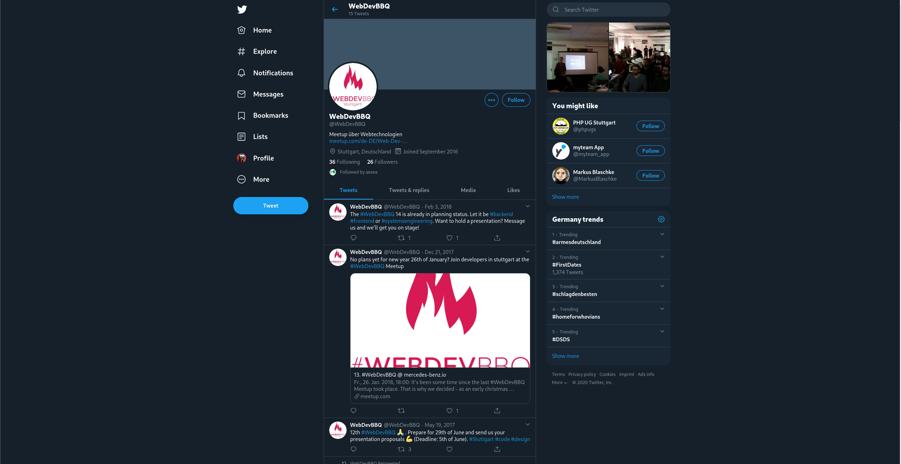
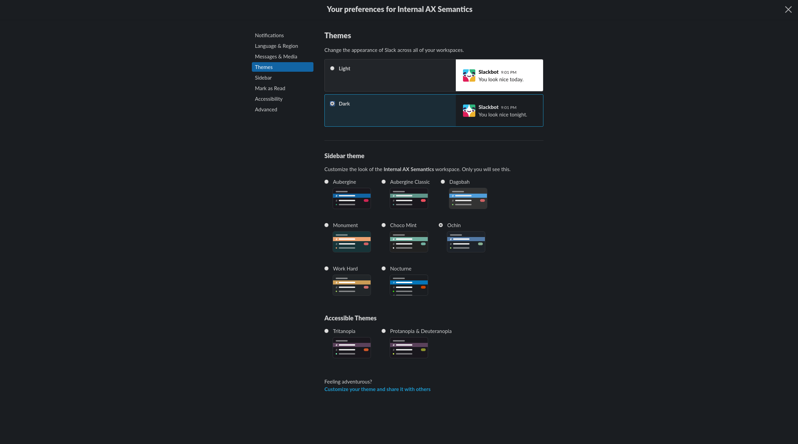
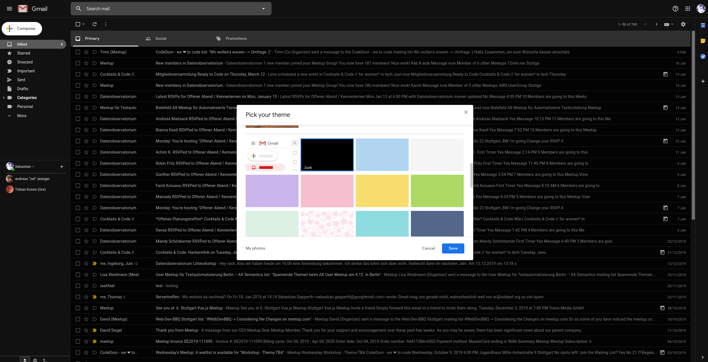
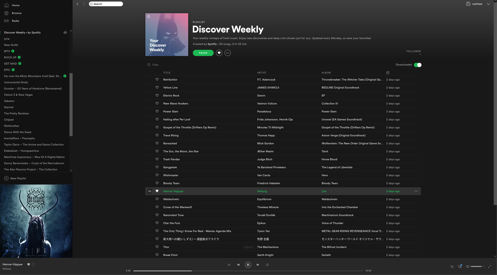

---

---

<h1>
<span class="dark">Dark</span>
Mode
</h1>

:::notes
- What? Changing colors (shade, lightness)

:::

---



:::notes

- my editor

:::

---

# CSS media query
`prefers-color-scheme`

---

### %(Basics)
### %(Human Vision / Contrast)
### %(Implementation and Pitfalls)

%(Break / Food)

### %(Open Floor)

:::notes
- 3 aspects

:::

---

# ~~Browser Extensions~~

:::notes

- 1st party support

:::

---

# CSS media query
`prefers-color-scheme`

---

```css
@media(prefers-color-scheme: light)
```

```css
@media(prefers-color-scheme: dark)
```

---

```js
window.matchMedia('(prefers-color-scheme: dark)')
```

---

# Based on OS preference

---

# OS Support

<div class="logos">


</div>

:::notes
Windows 10
Android 9+
macOS Mojave+
iOS 13
:::


---

# Browser Support
window.matchMedia('prefers-color-scheme: dark')
<div class="logos">


</div>

---

# Demo Time!

```css
@media(prefers-color-scheme: dark) {
	body {
		background-color: #263238;
		color: #FFF;
	}
}
```

---

# In the Real World

---

# DuckDuckGo

---

# FAZ

---

# Bugzilla

---

# Dark Themes

===



===



===



===


