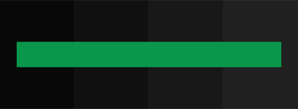
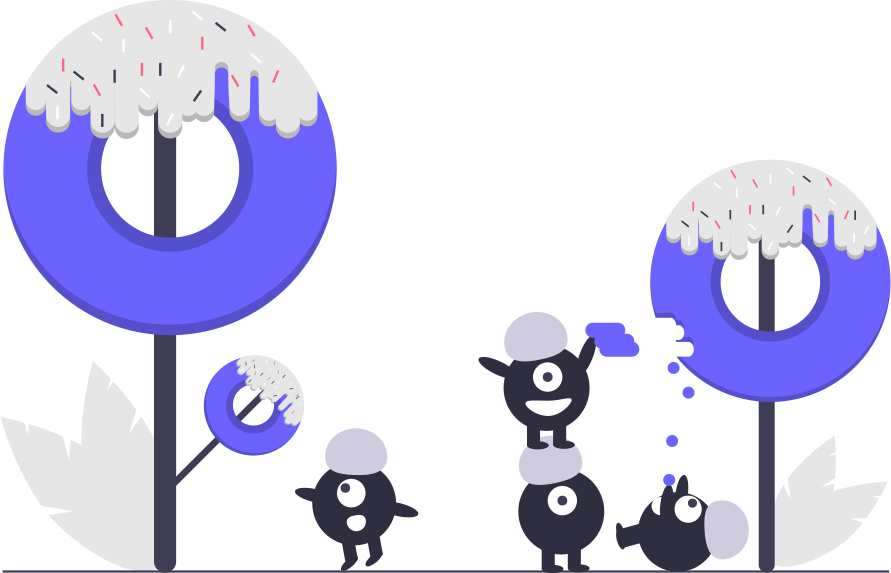

# Implementation
### and
# Pitfalls

---

# Choose Your Colors

===


===



===


===


===


===


===


===

<div class="shadow"></div>

===

<video class="small" v-if="active" src="~./assets/fails/shadow.mp4" autoplay="true" loop="true"/>

===

<div class="bordered"></div>

---

# Check Your Assets

===


===


===

<video class="small" v-if="active" src="~./assets/fails/white-video.webm" autoplay="true" loop="true"/>

===


===


===



---

# 3rd Party Integrations

===


---

# Implementation

===

```css
@media(prefers-color-scheme: dark) {
	body {
		background-color: #263238;
		color: #FFF;
	}
}
```

===

<fragment>

```css
@media(prefers-color-scheme: dark) {
	:root {
		--color-background: #263238;
		--color-text: #FFF;
	}
}
```

</fragment>

:::notes
- custom properties
:::

===

<fragment>

```html
<link href="base.css" rel="stylesheet">
<link href="theme.css" rel="stylesheet"
      media="prefers-color-scheme: dark">
```

</fragment>

===

<fragment>

```html
<picture>
  <source srcset="dark.svg" media="prefers-color-scheme: dark">
  
</picture>
```

</fragment>

===

# CSS Preprocessor Pains


:::notes
- css variables are awesome
- but, preprocessors
:::

===

```stylus
lightness(color) < 60% ? $clr-text-dark : $clr-text-light

alpha(color, 0.08)
```

:::notes
- CSS Color Level 5
:::

===

# Bundlers / Frameworks

:::notes
- Webpack
- Generate multiple stylesheets with different variables
- vue single file components
- css-in-js
:::

---

:::notes
- app settings theme switch / override
- prefers-contrast
:::
